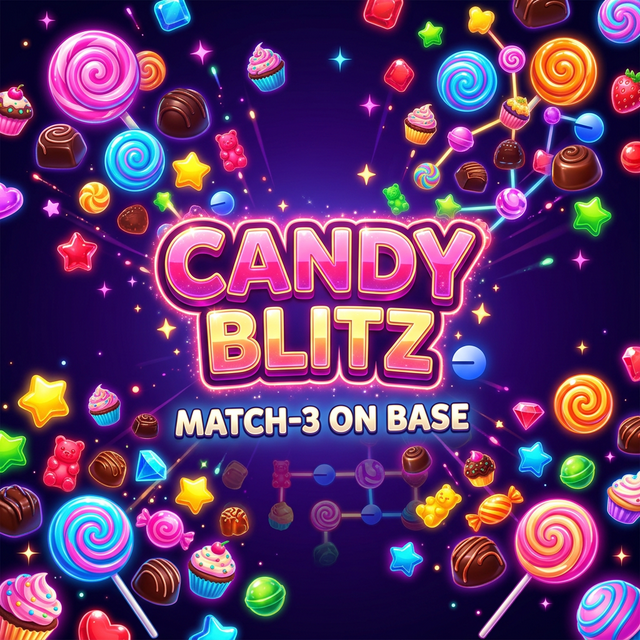

# 🍬 Candy Blitz — On-chain Match-3 on Base

A fully on-chain candy-matching game built as a **Base Mini App**. Match candies, beat records, and climb the leaderboard — all scores saved on Base blockchain.



## 🏗 Architecture

```
candy-blitz-base/
├── app/                    # Next.js app (React)
│   ├── page.tsx            # Main page — wallet modal + iframe
│   ├── rootProvider.tsx    # OnchainKit + wagmi provider (Base Mainnet)
│   └── layout.tsx          # Root layout
├── components/
│   └── GameWrapper.tsx     # Iframe bridge — postMessage ↔ wagmi
├── contracts/
│   └── CandyBlitz.sol      # Solidity smart contract
├── lib/
│   ├── blockchain.ts       # wagmi hooks (submitScore, leaderboard)
│   └── contract.ts         # Contract ABI + address
├── public/game/            # Original vanilla JS game (iframe)
│   ├── index.html          # Game entry point
│   ├── game-main.js        # Game logic (board, tiles, matching)
│   ├── blockchain-bridge.js # PostMessage bridge → React parent
│   ├── audio.js            # Sound effects + music
│   ├── effects.js          # Visual effects (particles, confetti)
│   └── config.js           # Levels, tile types, thresholds
└── minikit.config.ts       # Base Mini App manifest
```

### How it works

1. **React shell** (`page.tsx`) renders wallet UI and loads the game in an `<iframe>`
2. **Game** (vanilla JS in `public/game/`) runs the match-3 gameplay
3. **Communication** via `postMessage` between iframe ↔ React:
   - Game → React: `connect-wallet`, `submit-score`, `fetch-leaderboard`
   - React → Game: `wallet-connected`, `score-confirmed`, `leaderboard-data`
4. **Blockchain** (wagmi hooks) writes scores to Base via `CandyBlitz.sol`

## 📦 Smart Contract

**Address:** [`0x534DBC807c11f445342810d84a8DDEff7a249Fee`](https://basescan.org/address/0x534DBC807c11f445342810d84a8DDEff7a249Fee)
**Network:** Base Mainnet (Chain ID: 8453)
**Verified:** [Sourcify](https://repo.sourcify.dev/8453/0x534DBC807c11f445342810d84a8DDEff7a249Fee)

### Functions

| Function | Type | Description |
|----------|------|-------------|
| `submitScore(levelId, score, stars)` | write | Save a score on-chain |
| `getPlayer(address)` | view | Get player's best scores, stars, games |
| `getTotalScore(address)` | view | Sum of all best scores |
| `getLeaderboardBatch(offset, limit)` | view | Batch fetch for leaderboard |
| `getPlayerCount()` | view | Total unique players |

## 🚀 Getting Started

### Prerequisites

- Node.js 18+
- npm

### Setup

```bash
git clone https://github.com/Wistar777/Candy_Blitz_Base.git
cd Candy_Blitz_Base
npm install
```

### Environment Variables

Create a `.env` file:

```env
NEXT_PUBLIC_PROJECT_NAME="candy-blitz-base"
NEXT_PUBLIC_ONCHAINKIT_API_KEY="your_key_from_portal.cdp.coinbase.com"
NEXT_PUBLIC_URL="https://your-domain.vercel.app"
```

Get the OnchainKit API key from [portal.cdp.coinbase.com](https://portal.cdp.coinbase.com).

### Run Locally

```bash
npm run dev
```

Open [http://localhost:3000](http://localhost:3000).

## 🌐 Deployment

1. Push to GitHub
2. Connect repo on [vercel.com](https://vercel.com)
3. Add environment variables in Vercel dashboard
4. Deploy

## 🛠 Tech Stack

- **Frontend:** Next.js 15, React 19, TypeScript
- **Game:** Vanilla JavaScript (iframe)
- **Blockchain:** Solidity, wagmi, viem
- **Wallet:** OnchainKit, Base Smart Wallet
- **Chain:** Base Mainnet (L2)

## 📄 License

MIT
